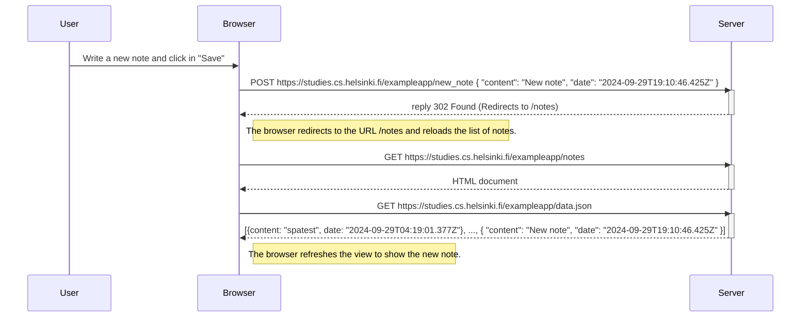

```mermaid
sequenceDiagram
    participant User
    participant Browser
    participant Server

    User->>Browser: Write a new note and click in "Save"
    Browser->>Server: POST https://studies.cs.helsinki.fi/exampleapp/new_note { "content": "New note", "date": "2024-09-29T19:10:46.425Z" }
    activate Server
    Server-->>Browser: reply 302 Found (Redirects to /notes)
    deactivate Server

    Note right of Browser: The browser redirects to the URL /notes and reloads the list of notes.

    Browser->>Server: GET https://studies.cs.helsinki.fi/exampleapp/notes
    activate Server
    Server-->>Browser: HTML document
    deactivate Server

    Browser->>Server: GET https://studies.cs.helsinki.fi/exampleapp/data.json
    activate Server
    Server-->>Browser: [{content: "spatest", date: "2024-09-29T04:19:01.377Z"}, ..., { "content": "New note", "date": "2024-09-29T19:10:46.425Z" }]
    deactivate Server

    Note right of Browser: The browser refreshes the view to show the new note.
```