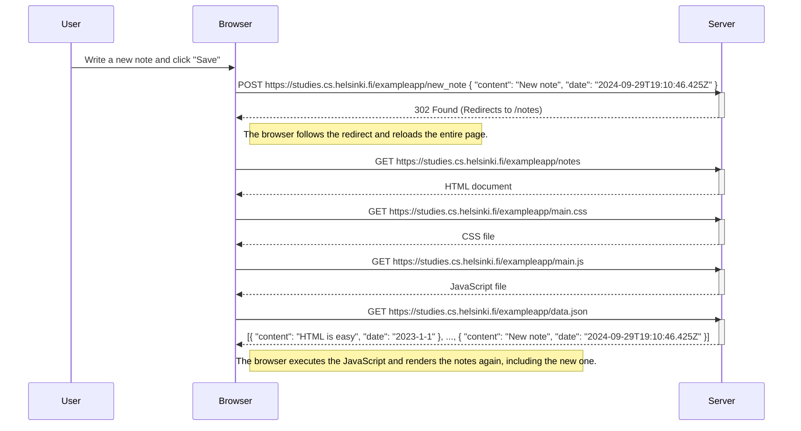

```mermaid
sequenceDiagram
    participant User
    participant Browser
    participant Server

    User->>Browser: Write a new note and click "Save"
    Browser->>Server: POST https://studies.cs.helsinki.fi/exampleapp/new_note { "content": "New note", "date": "2024-09-29T19:10:46.425Z" }
    activate Server
    Server-->>Browser: 302 Found (Redirects to /notes)
    deactivate Server

    Note right of Browser: The browser follows the redirect and reloads the entire page.

    Browser->>Server: GET https://studies.cs.helsinki.fi/exampleapp/notes
    activate Server
    Server-->>Browser: HTML document
    deactivate Server

    Browser->>Server: GET https://studies.cs.helsinki.fi/exampleapp/main.css
    activate Server
    Server-->>Browser: CSS file
    deactivate Server

    Browser->>Server: GET https://studies.cs.helsinki.fi/exampleapp/main.js
    activate Server
    Server-->>Browser: JavaScript file
    deactivate Server

    Browser->>Server: GET https://studies.cs.helsinki.fi/exampleapp/data.json
    activate Server
    Server-->>Browser: [{ "content": "HTML is easy", "date": "2023-1-1" }, ..., { "content": "New note", "date": "2024-09-29T19:10:46.425Z" }]
    deactivate Server

    Note right of Browser: The browser executes the JavaScript and renders the notes again, including the new one.
```