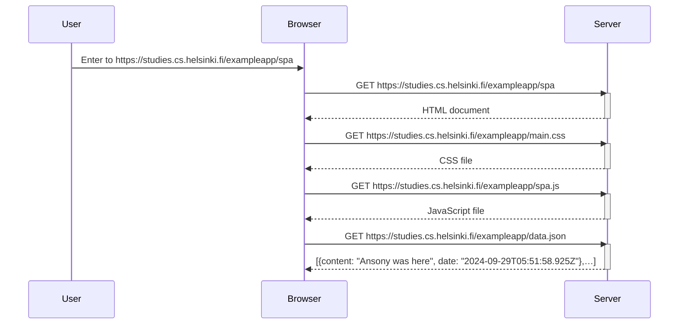

```mermaid
sequenceDiagram
    participant User
    participant Browser
    participant Server

    User->>Browser: Enter to https://studies.cs.helsinki.fi/exampleapp/spa
    Browser->>Server: GET https://studies.cs.helsinki.fi/exampleapp/spa
    activate Server
    Server-->>Browser: HTML document
    deactivate Server

    Browser->>Server: GET https://studies.cs.helsinki.fi/exampleapp/main.css
    activate Server
    Server-->>Browser: CSS file
    deactivate Server

    Browser->>Server: GET https://studies.cs.helsinki.fi/exampleapp/spa.js
    activate Server
    Server-->>Browser: JavaScript file
    deactivate Server

    Browser->>Server: GET https://studies.cs.helsinki.fi/exampleapp/data.json
    activate Server
    Server-->>Browser: [{content: "Ansony was here", date: "2024-09-29T05:51:58.925Z"},…]
    deactivate Server

```