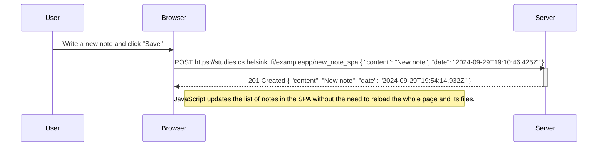

```mermaid
sequenceDiagram
    participant User
    participant Browser
    participant Server

    User->>Browser: Write a new note and click "Save"
    Browser->>Server: POST https://studies.cs.helsinki.fi/exampleapp/new_note_spa { "content": "New note", "date": "2024-09-29T19:10:46.425Z" }
    activate Server
    Server-->>Browser: 201 Created { "content": "New note", "date": "2024-09-29T19:54:14.932Z" }
    deactivate Server

    Note right of Browser: JavaScript updates the list of notes in the SPA without the need to reload the whole page and its files.
```